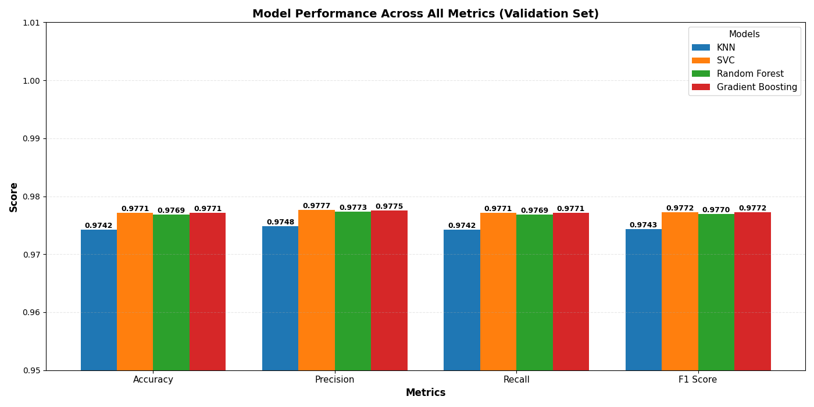

# Hand Gesture Recognition with Machine Learning

## Overview

This project focuses on building a machine learning model to recognize hand gestures using hand landmark data. The model processes normalized hand pose information to classify different hand gestures, enabling applications in human-computer interaction, sign language recognition, and gesture-based control systems.

## Dataset: HaGRID (Hand Gesture Recognition Image Dataset)

The project utilizes the **HaGRID (Hand Gesture Recognition Image Dataset)**, a comprehensive dataset containing hand gesture images with annotated hand landmarks. Key characteristics of the dataset:

- **Hand Landmarks**: 21 landmarks per hand, representing key points on the palm and fingers
- **Feature Format**: Each gesture is represented as a sequence of 3D coordinates (x, y, z) for each landmark
- **Raw Features**: 63 features per sample (21 landmarks × 3 coordinates)
- **Multiple Gestures**: The dataset includes various hand gesture categories for classification

The project used sample of 9000 rows from the dataset, which was preprocessed and loaded from the `hand_landmarks_data.csv` file, and contains both feature vectors and gesture labels.

## Preprocessing Details

The preprocessing pipeline applies the following transformations to ensure robust and generalizable model training:

### 1. **Z-Coordinate Elimination**
- Removed the z-coordinate from each landmark, keeping only x and y coordinates
- **Rationale**: The z-coordinate (depth information) can introduce irrelevant variations that depend on camera distance and positioning rather than the actual hand shape
- **Result**: Reduced from 63 features to 42 features per sample (21 landmarks × 2 coordinates)

### 2. **Wrist-Based Centering**
- Recentered all landmarks relative to the wrist position (landmark 0)
- **Purpose**: Makes the gesture representation invariant to absolute position in the image
- **Benefit**: The model focuses on the relative structure of the hand, not its location

### 3. **Hand Size Normalization**
- Normalized the coordinates by the mid-finger tip distance (distance from wrist to middle finger tip)
- **Rationale**: Removes scale variations caused by different hand sizes or camera distances
- **Benefit**: Ensures the model learns the true shape and structure of gestures, independent of irrelevant size variations

### Overall Impact
These preprocessing steps make the model:
- **More Robust**: Less sensitive to camera positioning, hand size, and distance variations
- **More Generalizable**: Focuses on the intrinsic gesture shape and relative landmark positions
- **Better Performance**: Reduces overfitting to irrelevant features in the training data

## Models Training

Once the data was preprocessed we experimented with four classifiers that seemed well-suited
to the problem:

1. **K-Nearest Neighbors (KNN)** – simple and interpretable; delivered decent accuracy but
   was not the top performer and showed some sensitivity to the choice of `k`.

2. **Support Vector Machine (SVM)** – produced strong results even without extensive tuning.

3. **Random Forest (RF)** – low variance and robust; attractive due to ensemble stability.

4. **Gradient Boosting (GB)** – matched the accuracy of SVM/RF, but the training time
   was significantly longer, making it impractical for this project's scope.

### Summary of Validation Results

Below is a tabular summary of the validation metrics obtained for each classifier:

| Model              | Accuracy  | Precision | Recall    | F1 Score  |
|-------------------:|:---------:|:---------:|:---------:|:---------:|
| KNN                | 0.974197  | 0.974802  | 0.974197  | 0.974323  |
| SVC                | 0.977118  | 0.977683  | 0.977118  | 0.977208  |
| Random Forest      | 0.976874  | 0.977308  | 0.976874  | 0.976961  |
| Gradient Boosting  | 0.977118  | 0.977537  | 0.977118  | 0.977217  |

A visual comparison can also be found in the grouped‑bar chart saved in the project
`models_artifacts` directory:



### Model Selection

Initial comparisons showed KNN trailing the other three methods. SVM, RF and GB all
achieved similar validation scores, so GB was dropped solely for its long training
times. RF was promising because of its low variability; we spent time fine‑tuning its
hyperparameters, but it never outperformed the untuned SVM.

After further tuning of SVM's regularization parameter `C` we arrived at the following
validation accuracies:

```
C = 60  → 0.9825  
C = 50  → 0.9832  
C = 40  → 0.9810  
```

Based on these results, the best performance was achieved with **C = 50**, so the final
model used a tuned SVM classifier with that parameter.

This evaluation guided the final choice of model for the project.

## Inference and Real‑time Prediction

The final SVM model is not only evaluated on static samples but also used in a
real‑time inference pipeline that processes video frames. The steps are as follows:

1. **MediaPipe Hand Landmarker** is loaded using the official `.task` file and used to
   detect hand landmarks in each incoming video frame.
2. **Landmark Conversion**: Detected 21 hand keypoints are converted into the same
   42‑dimensional feature vector (x,y coordinates only, wrist‑centered and scale
   normalized) used during training.
3. **Prediction**: The pre‑trained SVM predicts the gesture label for each frame.
4. **Temporal Smoothing**: A sliding window of recent predictions is maintained and
   the most frequent label within the window is displayed to stabilize the output.
5. **Visualization**: Hand skeletons and the current gesture label are drawn onto the
   original frame, and the annotated video is saved as `output.mp4`.

This pipeline allows the model to be evaluated on live or recorded video, demonstrating
its applicability in dynamic, real‑world scenarios.

## Getting Started

To replicate or extend this project locally, follow these steps:

1. **Clone the repository**:
   ```sh
   git clone <repository-url>  # replace with actual URL
   cd ML1_Project
   ```
2. **Create and activate a Python virtual environment**:
   ```sh
   python -m venv .venv
   # Windows PowerShell
   .\.venv\Scripts\Activate.ps1
   # or Git Bash/CMD
   # .\.venv\Scripts\activate
   ```
3. **Install dependencies**:
   ```sh
   pip install -r requirements.txt
   ```
4. **Download MediaPipe hand landmarker task file** (required for inference):
   ```python
   import urllib.request
   urllib.request.urlretrieve(
       "https://storage.googleapis.com/mediapipe-models/hand_landmarker/hand_landmarker/float16/1/hand_landmarker.task",
       "hand_landmarker.task")
   ```
5. **Run the notebook**:
   ```sh
   jupyter notebook handGestures_classification.ipynb
   ```

The above will allow you to preprocess data, train models, and run inference using
an example video. Adjust parameters or paths as needed.

## Tech Stack

- **Language**: Python 3.12
- **Data Processing & ML**:
  - `pandas` – Data loading and cleaning
  - `numpy` – Numerical operations
  - `scikit-learn` – Model training, evaluation and preprocessing utilities
- **Computer Vision & Inference**:
  - `mediapipe` – Hand landmark detection
  - `opencv-python` – Video frame handling and drawing
- **Serialization**:
  - `joblib` – Saving and loading trained models and encoders
- **Visualization**:
  - `matplotlib`, `seaborn` – Charts and confusion matrices
- **Development**:
  - Jupyter Notebook for exploratory work
  - Python virtual environment (`venv`) to isolate dependencies


## Project Structure

```
ML1_Project/
├── README.md                          # Project documentation
├── handGestures_classification.ipynb  # Primary notebook with all experiments
├── utils.py                           # Preprocessing and visualization helpers
├── hand_landmarks_data.csv            # Raw dataset sample used for training
├── models_artifacts/                  # Saved models, encoders, and plots
│   ├── svc_model.joblib               # Final SVM classifier
│   ├── label_encoder.joblib           # Label encoder for gestures
│   ├── comparison_grouped_bar_chart.png
│   └── ...                           
└── hand_landmarker.task               # MediaPipe model file downloaded for inference
```

## Conclusion

The project demonstrates a complete pipeline for hand gesture recognition using
MediaPipe landmarks and classical machine learning. After careful preprocessing
and comparison of multiple classifiers, a tuned SVM emerged as the most accurate
and efficient model. The resulting system not only achieves high validation scores
but also operates in a real‑time video inference setup, making it suitable for
interactive applications such as sign language interfaces or gesture controls.
Future work could explore deep learning approaches, expand the gesture set, or
deploy the pipeline in a dedicated application.


