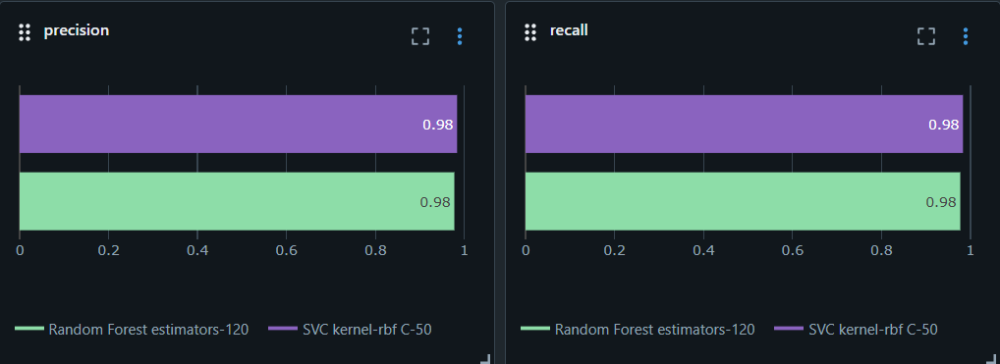

# Hand Gesture Recognition with Machine Learning

## Overview

This project focuses on building a machine learning model to recognize hand gestures using hand landmark data. The model processes normalized hand pose information to classify different hand gestures, enabling applications in human-computer interaction, sign language recognition, and gesture-based control systems.


## Dataset: HaGRID (Hand Gesture Recognition Image Dataset)

The project utilizes the **HaGRID (Hand Gesture Recognition Image Dataset)**, a comprehensive dataset containing hand gesture images with annotated hand landmarks. Key characteristics of the dataset:

- **Hand Landmarks**: 21 landmarks per hand, representing key points on the palm and fingers
- **Feature Format**: Each gesture is represented as a sequence of 3D coordinates (x, y, z) for each landmark
- **Raw Features**: 63 features per sample (21 landmarks × 3 coordinates)
- **Multiple Gestures**: The dataset includes various hand gesture categories for classification

The project used 25675 samples from the dataset, which was preprocessed and loaded from the `hand_landmarks_data.csv` file, and contains both feature vectors and gesture labels.

## Preprocessing Details

The preprocessing pipeline applies the following transformations to ensure robust and generalizable model training:

### 1. **Z-Coordinate Elimination**
- Removed the z-coordinate from each landmark, keeping only x and y coordinates
- **Rationale**: The z-coordinate (depth information) can introduce irrelevant variations that depend on camera distance and positioning rather than the actual hand shape
- **Result**: Reduced from 63 features to 42 features per sample (21 landmarks × 2 coordinates)

### 2. **Wrist-Based Centering**
- Recentered all landmarks relative to the wrist position (landmark 0)
- **Purpose**: Makes the gesture representation invariant to absolute position in the image
- **Benefit**: The model focuses on the relative structure of the hand, not its location

### 3. **Hand Size Normalization**
- Normalized the coordinates by the mid-finger tip distance (distance from wrist to middle finger tip)
- **Rationale**: Removes scale variations caused by different hand sizes or camera distances
- **Benefit**: Ensures the model learns the true shape and structure of gestures, independent of irrelevant size variations

### Overall Impact
These preprocessing steps make the model:
- **More Robust**: Less sensitive to camera positioning, hand size, and distance variations
- **More Generalizable**: Focuses on the intrinsic gesture shape and relative landmark positions
- **Better Performance**: Reduces overfitting to irrelevant features in the training data


## Models Training

Once the data was preprocessed we experimented with four classifiers that seemed well-suited
to the problem:

1. **K-Nearest Neighbors (KNN)** – simple and interpretable; delivered decent accuracy but
   was not the top performer and showed some sensitivity to the choice of `k`.

2. **Support Vector Machine (SVM)** – produced strong results even without extensive tuning.

3. **Random Forest (RF)** – low variance and robust; attractive due to ensemble stability.

4. **Gradient Boosting (GB)** – matched the accuracy of SVM/RF, but the training time
   was significantly longer, making it impractical for this project's scope.

### Summary of Validation Results

Below is a tabular summary of the validation metrics obtained for each classifier:

| Model              | Accuracy  | Precision | Recall    | F1 Score  |
|-------------------:|:---------:|:---------:|:---------:|:---------:|
| KNN                | 0.974197  | 0.974802  | 0.974197  | 0.974323  |
| SVC                | 0.977118  | 0.977683  | 0.977118  | 0.977208  |
| Random Forest      | 0.976874  | 0.977308  | 0.976874  | 0.976961  |
| Gradient Boosting  | 0.977118  | 0.977537  | 0.977118  | 0.977217  |

A visual comparison can also be found in the grouped‑bar chart saved in the project
`models_artifacts` directory:


### Model Selection

Initial comparisons showed KNN trailing the other three methods. SVM, RF and GB all
achieved similar validation scores, so GB was dropped solely for its long training
times. RF was promising because of its low variability; we spent time fine‑tuning its
hyperparameters, but it never outperformed the untuned SVM.


After further tuning of SVM's regularization parameter `C` we arrived at the following
validation accuracies:

```
C = 60  → 0.9825  
C = 50  → 0.9832  
C = 40  → 0.9810  
```

Based on these results, the best performance was achieved with **C = 50**, so the final
model used a tuned SVM classifier with that parameter.




This evaluation guided the final choice of model for the project.


## Tech Stack

- **Language**: Python 3.12
- **Data Processing & ML**:
  - `pandas` – Data loading and cleaning
  - `numpy` – Numerical operations
  - `scikit-learn` – Model training, evaluation and preprocessing utilities
- **Computer Vision & Inference**:
  - `mediapipe` – Hand landmark detection
  - `opencv-python` – Video frame handling and drawing
- **Serialization**:
  - `joblib` – Saving and loading trained models and encoders
- **Visualization**:
  - `matplotlib`, `seaborn` – Charts and confusion matrices
- **Development**:
  - Jupyter Notebook for exploratory work
  - Python virtual environment (`venv`) to isolate dependencies


## Project Structure

```
ML1_Project/
├── README.md                          # Project documentation
├── handGestures_classification.ipynb  # Primary notebook with all experiments
├── utils.py                           # Preprocessing and visualization helpers
├── hand_landmarks_data.csv            # Raw dataset sample used for training
├── models_artifacts/                  # Saved models, encoders, and plots
│   ├── svc_model.joblib               # Final SVM classifier
│   ├── label_encoder.joblib           # Label encoder for gestures
│   ├── comparison_grouped_bar_chart.png
│   └── ...                           
└── hand_landmarker.task               # MediaPipe model file downloaded for inference
```

## Conclusion

This project not only demonstrates how to preprocess hand landmark data and train
several classification algorithms, but also how to manage the experimentation
life‑cycle using **MLflow**. During development every model fit and evaluation was
wrapped in MLflow `run` contexts. Key features leveraged include:

- **Logging experiments** – parameters, metrics, artifacts (trained models, plots)
  were automatically captured via the `mlflow` Python API.
- **Model registry** – the best-performing models (e.g. the tuned SVM) were
  registered so they can be easily loaded for inference or compared against future
  candidates.
- **Tracking UI** – by starting `mlflow ui` the team could browse all runs,
  compare metrics side-by-side, and inspect hyperparameter effects in an
  organized table/chart view.

As a result, MLflow provided a structured way to record every training run and
compare them meaningfully, enabling reproducibility and informed decision‑making
when selecting the final model. Future work can continue to log additional
variants and use the MLflow UI to compare them in a centralized, searchable
interface.


